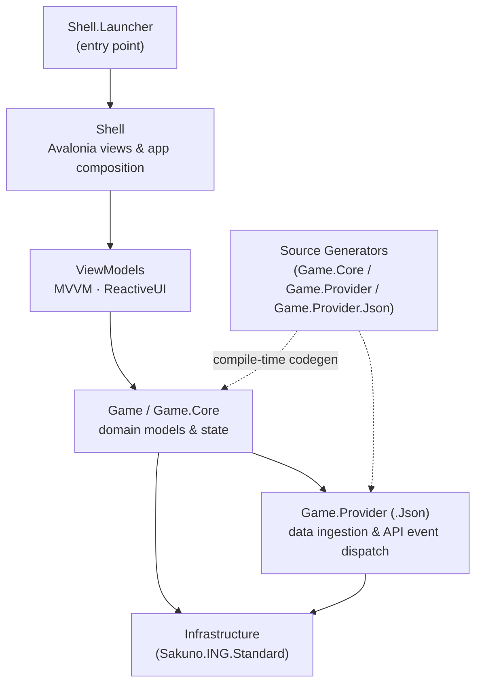

# ING

[](https://github.com/amatukaze/ing/actions/workflows/build-and-test.yml)

A flexible, powerful and lightweight KanColle tool/browser.

## Screenshots (Legacy Version)


## Branches

| Branch | Description |
|---|---|
| `master` | Generation 2 (in progress): full rewrite with Avalonia + ReactiveUI |
| `legacy` | Generation 1: WPF, released version |

## Architecture



## Build & Run

Requires the **.NET 10 SDK**.

```bash
git clone https://github.com/amatukaze/ing.git
cd ing

dotnet build

# Run the desktop client
dotnet run --project src/Shell/Sakuno.ING.Shell.Launcher

# Run all tests
dotnet test
```

### License
The MIT License (MIT)
